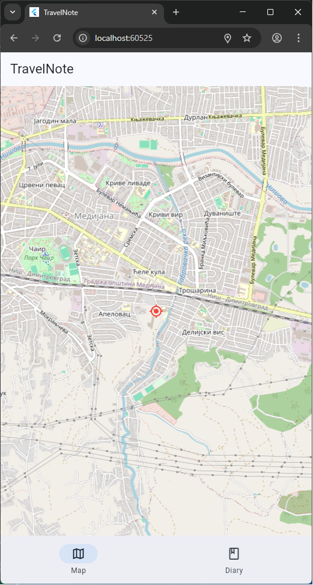
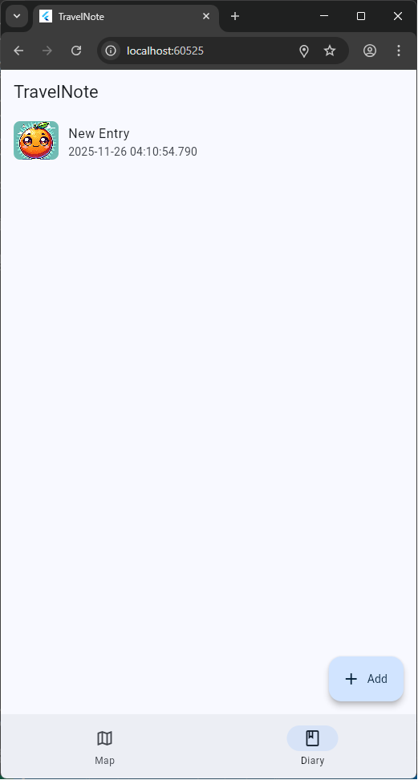
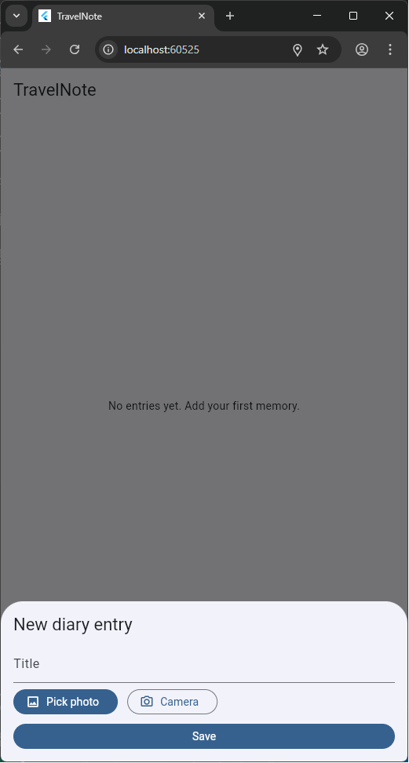

TravelNote — Offline Map, Photos, and Diary Entries

Overview

- Built to showcase offline‑friendly UX with a map, GPS, photo capture, and local persistence. Uses OpenStreetMap tiles, so no API keys are required.

Highlights

- Map + GPS: `flutter_map` with current location marker.
- Photos: Pick from gallery or camera and store locally.
- Diary: Entries saved as JSON in app documents; images written to files.

Tech

- Flutter · Dart · flutter_map · geolocator · image_picker · path_provider · UUID

Architecture

- UI: `Home` with two tabs (Map, Diary)
- Domain: `DiaryEntry` model (JSON)
- Storage: JSON file in app documents; images saved to files
- Services: Geolocator for GPS; ImagePicker for photos

Screenshots

- 
- 
- 

Run

- `flutter pub get`
- `flutter run`
- Grant location and camera/gallery permissions on device.
